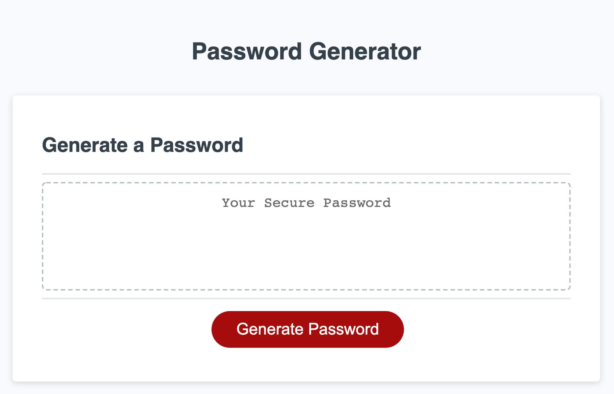

# Password Generator

site: https://425megs.github.io/Password-Gen/
repo: https://github.com/425megs/Password-Gen

## User Story
AS AN employee with access to sensitive data
I WANT to randomly generate a password that meets certain criteria
SO THAT I can create a strong password that provides greater security

## Description
This site enables users to generate random passwords based on criteria that they’ve selected in pop-up messages. The password can be between 8-128 characters and include upper/lower case letter, numbers and or special characters. Once the preferences have been selected, the password will display.

- - -
© 2021 Trilogy Education Services, LLC, a 2U, Inc. brand. Confidential and Proprietary. All Rights Reserved.
